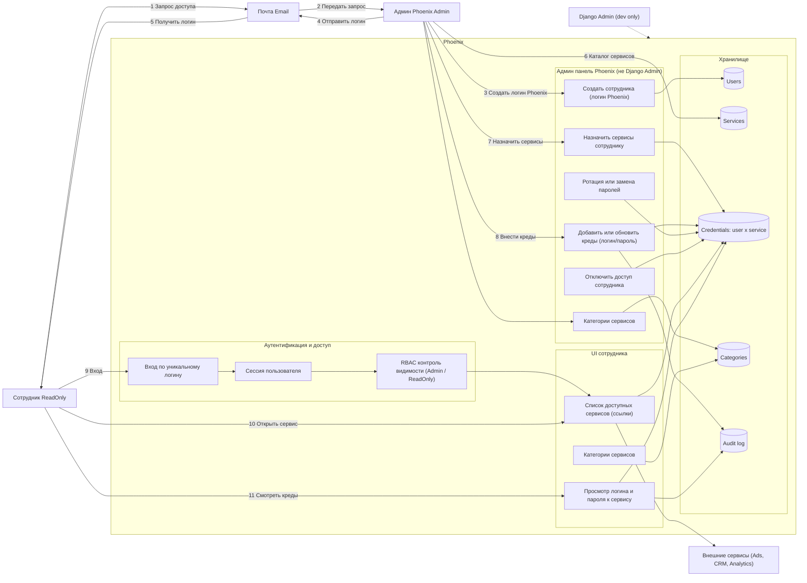

```mermaid
flowchart LR
  E["Сотрудник ReadOnly"]
  A["Админ Phoenix Admin"]
  D["Django Admin (dev only)"]

  Mail["Почта Email"]
  Ext["Внешние сервисы (Ads, CRM, Analytics)"]

  subgraph P["Phoenix"]
    direction TB

    subgraph Auth["Аутентификация и доступ"]
      L1["Вход по уникальному логину"]
      L2["Сессия пользователя"]
      ACL["RBAC контроль видимости (Admin / ReadOnly)"]
    end

    subgraph AdminPanel["Админ панель Phoenix (не Django Admin)"]
      U1["Создать сотрудника (логин Phoenix)"]
      U2["Назначить сервисы сотруднику"]
      U3["Добавить или обновить креды (логин/пароль)"]
      U4["Категории сервисов"]
      U5["Отключить доступ сотрудника"]
      U6["Ротация или замена паролей"]
    end

    subgraph EmpUI["UI сотрудника"]
      V1["Список доступных сервисов (ссылки)"]
      V2["Категории сервисов"]
      V3["Просмотр логина и пароля к сервису"]
    end

    subgraph Data["Хранилище"]
      DB1[(Users)]
      DB2[(Services)]
      DB3[(Credentials: user x service)]
      DB4[(Categories)]
      AUD[(Audit log)]
    end
  end

  E -->|"1 Запрос доступа"| Mail
  Mail -->|"2 Передать запрос"| A
  A -->|"3 Создать логин Phoenix"| U1
  U1 --> DB1
  A -->|"4 Отправить логин"| Mail
  Mail -->|"5 Получить логин"| E

  A -->|"6 Каталог сервисов"| DB2
  A --> U4 --> DB4
  A -->|"7 Назначить сервисы"| U2 --> DB3
  A -->|"8 Внести креды"| U3 --> DB3
  U3 --> AUD
  U6 --> DB3
  U5 --> DB3

  E -->|"9 Вход"| L1 --> L2
  L2 --> ACL
  ACL --> V1
  V2 --> DB4
  V1 --> DB3
  E -->|"10 Открыть сервис"| V1 --> Ext
  E -->|"11 Смотреть креды"| V3 --> DB3
  V3 --> AUD

  D -.-> P
```
