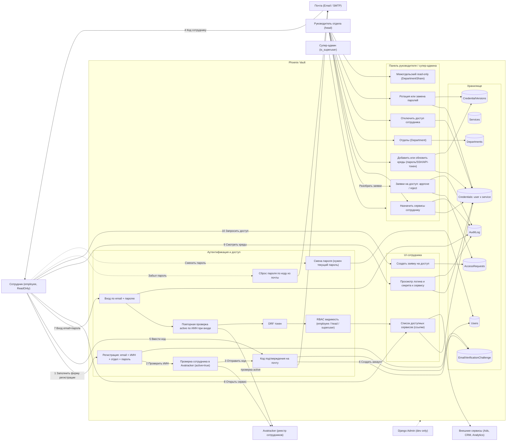

```mermaid
flowchart LR
  E["Сотрудник (employee, ReadOnly)"]
  H["Руководитель отдела (head)"]
  A["Супер-админ (is_superuser)"]
  D["Django Admin (dev only)"]

  Mail["Почта (Email / SMTP)"]
  Reg["Avatracker (реестр сотрудников)"]
  Ext["Внешние сервисы (Ads, CRM, Analytics)"]

  subgraph P["Phoenix Vault"]
    direction TB

    subgraph Auth["Аутентификация и доступ"]
      R1["Регистрация: email + ИИН + отдел + пароль"]
      R2["Проверка сотрудника в Avatracker (active=true)"]
      R3["Код подтверждения на почту"]
      L1["Вход по email + паролю"]
      L2["Повторная проверка active по ИИН при входе"]
      PR["Сброс пароля по коду из почты"]
      PC["Смена пароля (нужен текущий пароль)"]
      ACL["RBAC видимость (employee / head / superuser)"]
      TOK["DRF токен"]
    end

    subgraph ManagerUI["Панель руководителя / супер-админа"]
      U2["Назначить сервисы сотруднику"]
      U3["Добавить или обновить креды (пароль/SSH/API-токен)"]
      U4["Отделы (Department)"]
      U5["Отключить доступ сотрудника"]
      U6["Ротация или замена паролей"]
      U7["Заявки на доступ: approve / reject"]
      U8["Межотдельский read-only (DepartmentShare)"]
    end

    subgraph EmpUI["UI сотрудника"]
      V1["Список доступных сервисов (ссылки)"]
      V3["Просмотр логина и секрета к сервису"]
      V4["Создать заявку на доступ"]
    end

    subgraph Data["Хранилище"]
      DB1[(Users)]
      DB2[(Services)]
      DB3[(Credentials: user x service)]
      DB4[(Departments)]
      DB5[(AccessRequests)]
      DB6[(CredentialVersions)]
      EVC[(EmailVerificationChallenge)]
      AUD[(AuditLog)]
    end
  end

  E -->|"1 Заполнить форму регистрации"| R1
  R1 -->|"2 Проверить ИИН"| R2 --> Reg
  R2 -->|"3 Отправить код"| R3 --> Mail
  Mail -->|"4 Код сотруднику"| E
  E -->|"5 Ввести код"| R3
  R3 -->|"6 Создать аккаунт"| DB1
  R1 --> EVC
  R3 --> EVC

  E -->|"7 Вход email+пароль"| L1 --> L2
  L2 -->|"проверка active"| Reg
  L2 --> TOK --> ACL
  ACL --> V1
  V1 --> DB3
  E -->|"8 Открыть сервис"| V1 --> Ext
  E -->|"9 Смотреть креды"| V3 --> DB3
  V3 --> AUD
  E -->|"10 Запросить доступ"| V4 --> DB5

  E -.->|"Забыл пароль"| PR --> Mail
  E -.->|"Сменить пароль"| PC --> DB1

  H -->|"Разобрать заявки"| U7 --> DB5
  H --> U2 --> DB3
  H --> U3 --> DB3
  H --> U4 --> DB4
  H --> U5 --> DB3
  H --> U6 --> DB3
  H --> U8
  U3 --> DB6
  U6 --> DB6
  A --> ManagerUI

  L1 --> AUD
  U2 --> AUD
  U7 --> AUD

  D -.-> P
```
