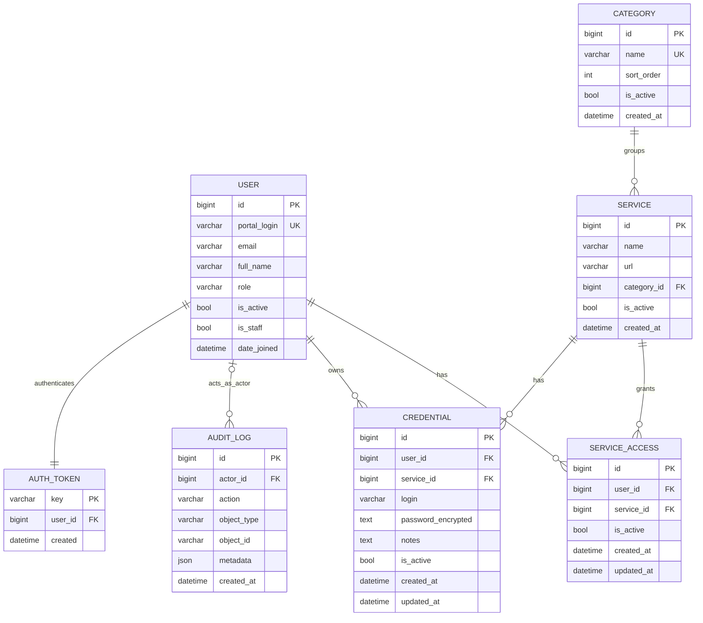

Notes:
- `SERVICE_ACCESS` and `CREDENTIAL` both enforce unique `(user_id, service_id)`.
- `AUDIT_LOG.actor_id` is nullable (`SET_NULL`), so logs survive user deletion.
- `CREDENTIAL.password_encrypted` is stored encrypted via custom `EncryptedTextField`.
