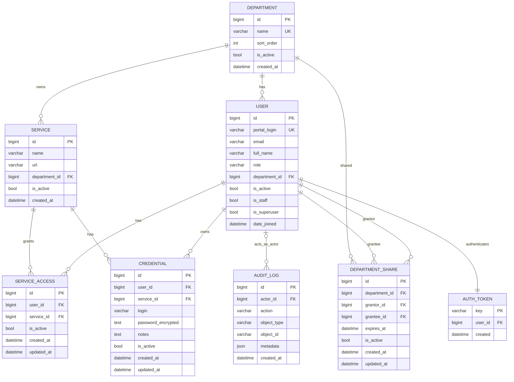

Notes:
- `SERVICE_ACCESS` and `CREDENTIAL` enforce unique `(user_id, service_id)`.
- `DEPARTMENT_SHARE` enforces unique `(department_id, grantor_id, grantee_id)`.
- `CREDENTIAL.password_encrypted` stored via `EncryptedTextField` (asymmetric envelope encryption if configured).
